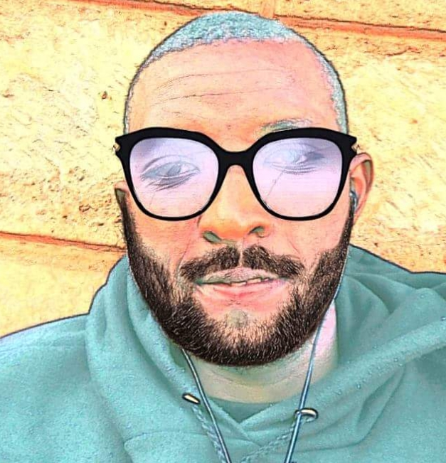

# DERRICK'S Portfolio.
#### Created on, 17.03.2018
#### By **Derrick**

## Description
This is a portfolio blog i created as a part of my assignment at moringa school.

## Technologies used.
Html and css technologies is used to develop the portfolio site.
Git is used on the other side as the version control for tracking changes on the local and remote repository.

## Procedure for development And deployment to git pages.
Html file first created to give the site a structure then styles added using css as the changes are being tracked continously using git.

### Follow along.

* Create a remote repository on github.
* Initialize a local repository using **git init** command on the project directory.
* Create the required html and css files and image directories.
* Create a new branch called gh-pages **git branch gh-pages**.
* Use **git add .** to add files and folders to git so that the project can be monitored then issue **git commit -m "message here"** to commit to staging area.
* Then connect with the remote repository **git remote add origin <url.git>**
* Then push to the remote repository on github.**git push origin master**.

## Accessing the portfolio.
The site can be viewed from here [dery's blog](https://muriithiderro.github.io/portfolio/) or [portfolio github repository](https://github.com/muriithiderro/portfolio).

### License
*The site and materials can be accessed by the public freely*

Copyright (c) 2018 **[Derrick](https://github.com/muriithiderro)**
